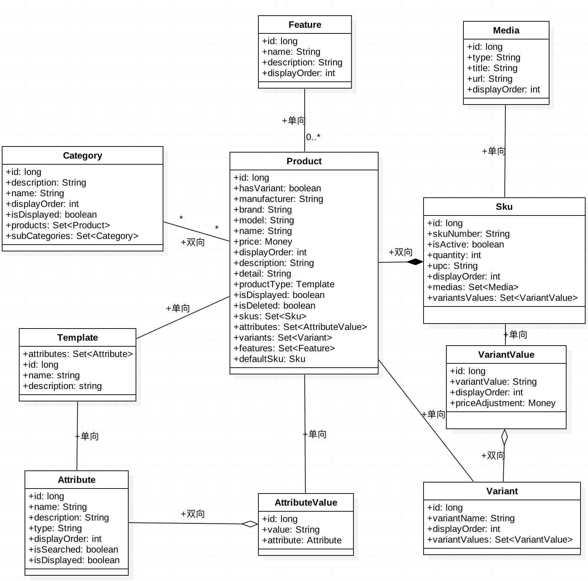

## 1. Introduce
This document describes the design for catalog service.

## 2. Technology Component
* SpringBoot and Spring Framework
* GRPC
* Gradle
* Spock
* Mysql

## 3. GRPC API
In Catalog Service, provide 3 rpc API for Customer Web, defined in 3 proto file:
* [catalog_category_service.proto](https://github.com/reactivesw/catalog_proto/blob/master/catalog_category_service.proto)
* [catalog_product_service.proto](https://github.com/reactivesw/catalog_proto/blob/master/catalog_product_service.proto)
* [catalog_sku_service.proto](https://github.com/reactivesw/catalog_proto/blob/master/catalog_sku_service.proto)

The request and response message are defined in 4 proto file:
* [catalog_data_message.proto](https://github.com/reactivesw/catalog_proto/blob/master/catalog_data_message.proto)
* [catalog_category_message.proto](https://github.com/reactivesw/catalog_proto/blob/master/catalog_category_message.proto)
* [catalog_product_message.proto](https://github.com/reactivesw/catalog_proto/blob/master/catalog_product_message.proto)
* [catalog_sku_message.proto](https://github.com/reactivesw/catalog_proto/blob/master/catalog_sku_message.proto)

All service, api, message add defined in [catalog_proto](https://github.com/reactivesw/catalog_proto).

### 3.1 CategoryService
#### 3.1.1 getCategories
* description: get all categories.
* parameters:Empty - no request
* return:CategoryList - list of GrpcCategory
* key point: 
  * category should be only one layer.
* workflow:
  * find all category in order of `displayOrder`, return `List<Category>` to GRPC Server
  * if can not find any category, throw `NotFoundException` to GRPC Server
  * GRPC Server transfer `List<Category>` to `CategoryList`, and return to Client
  * if GRPC Server catch `NotFoundException`, throw `StatusRuntimeException` with `Status.INTERNAL` to Client
* exception:

exception status | message | Customerized exception | description
-----------------|---------|------------------------|--------------
INTERNAL         | "System error."|InternalException|cann't get any category

### 3.2 ProductService
#### 3.2.1 getProductsByCategory
* description: get list of product by category id.
* parameters:IntValue - id of category
* return:ProductBriefList - list of ProductBrief
* workflow:
  * if category is not exist, throw `NotFoundException` to GRPC Server
  * if category is exist, find all product by category id
  * if products is empty, make it be new List and return to GRPC Server
  * if products is not empty, should use first sku instead of default sku, return to GRPC Server
  * GRPC Server transfer `List<Product>` to `ProductBriefList`, and return to Client
  * if GRPC Server catch `NotFoundException`, throw `StatusRuntimeException` with `Status.NOT_FOUND` to Client
* exception:

exception status | message | Customerized exception | description
-----------------|---------|------------------------|--------------
NOT_FOUND        |" category id is not exist " | NotFoundException | Category is not exist

## 3.3 SkuService
#### 3.3.1 querySkuDetail
* description: get sku detail by sku number.
* parameters: StringValue - sku number
* return: GrpcSkuDetail - sku detail
* workflow:
  *  query sku by sku number, if sku is null, throw `NotFoundException` to GRPC Server
  *  if sku is default sku for product, product should not have any other sku, return this product to GRPC Server
  *  if sku is not a default sku, should add sku number, is_active, selected to variant value
  *  GRPC Server catch `NotFoundException`, throw `StatusRuntimeException` with `Status.NOT_FOUND` to Client
  *  GRPC Server transfer `Product` and additional properties to `GrpcSkuDetail`, return to Client
* exception:

exception status | message | Customerized exception | description
-----------------|---------|------------------------|--------------
NOT_FOUND        | "product is not exist" | NotFoundException | conn't get product by this id

---

## 4. Exception
GrpcException status | Customerized Exception | description
---------------------|------------------------|----------------------------
NOT_FOUND            | NotFoundException      | when something conn't found 
INTERNAL             | InternalException      | when something going wrong and don't know what heppend

---

## 5. Data 
In database, define following table:

#### Category
name | type | nullable | description | related
-|-|-|-|-|
category_id | long | no | primary key, auto increment | 
name | String | no | category name, max length is 255 | 
description | String | yes | description of category, max length is 1024 |
displayOrder | int | yes | display order of category, optional field, default is 0|
createdTime | ZonedDateTime | no | store date time when create category, should be utc |
modifiedTIme | ZonedDateTime | no | store date time when modify category, should be utc |